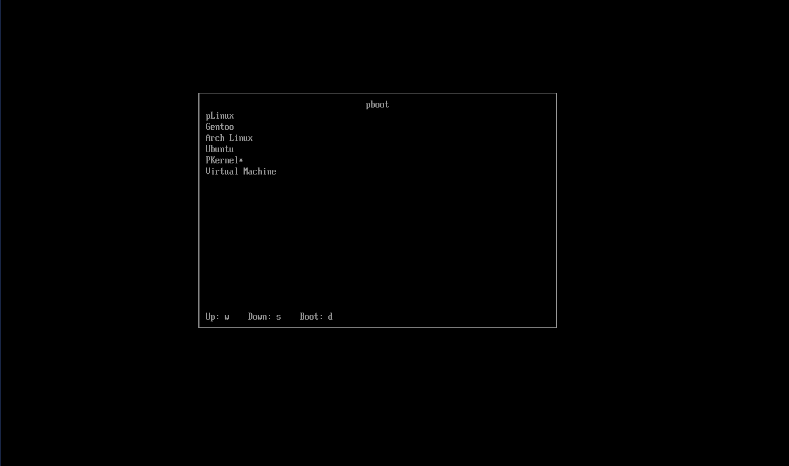

EFI bootloader

100% functional in real environments.

You can load Linux kernels with parameters.

## Build

    make

## Testing in Virtual Machine
    
    ./start

## Installation
    
    mount -t efivarfs none /sys/firmware/efi/efivars
    mkdir -p /boot/EFI/pboot
    cp pboot /boot/EFI/pboot/pboot.efi
    efibootmgr --create --disk /dev/nvme0n1 --part 1 -L "pboot" --loader '\EFI\pboot\pboot.efi'
